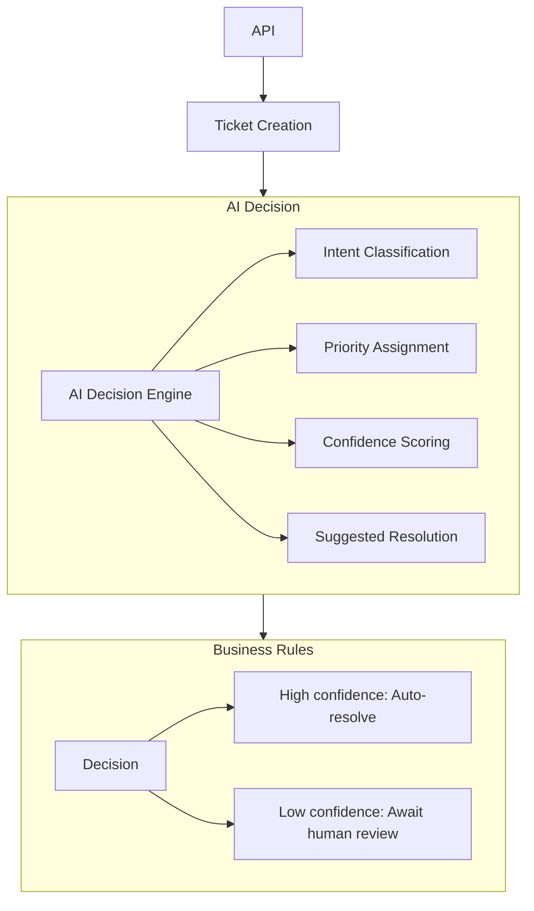

# AI-Powered Customer Support Backend

A production-oriented backend service for customer support ticket ingestion and AI-driven decisioning.
This project demonstrates how to integrate Large Language Models (LLMs) as deterministic decision engines.

The system classifies incoming tickets, assigns priority, and routes them based on confidence-aware AI outputs, with clean abstractions designed for future async and distributed processing.

## Key Features

- Ticket management API (FastAPI + SQLAlchemy)
- AI decision engine with:
  - Structured JSON outputs
  - Pydantic validation
  - Deterministic behavior
- Confidence-based routing
  - Auto-resolve high-confidence tickets
  - Escalate uncertain cases to human review
 
  
## AI Design Philosophy

This project treats AI as a decision layer.
Key principles:
- Typed outputs (Pydantic schemas)
- Explicit confidence scores
- Business-rule enforcement outside the model
- No direct database mutations from AI code
> “The model recommends — the system decides.”

## Architecture Overview



## AI Output Schema
All AI decisions conform to a strict schema:
```
{
  "intent": "billing | technical_issue | account | general_question | unknown",
  "priority": "low | medium | high",
  "confidence": 0.0 - 1.0
  "suggestion": AI-generated suggestion based on given policies
}
```

Responses that fail validation are rejected before affecting system state.

## API Endpoints
### Create Ticket
```
POST /tickets/
```
Create a ticket with subject, body, and customer email
### Get Tickets
```
GET /tickets/
```
Get list of tickets
### Get Ticket
```
GET /tickets/{ticket id}
```
Get specific ticket
### Run AI Evaluation
```
POST /tickets/{ticket id}/ai-evaluate
```
Run AI Decision model on a specific ticket and updates ticket accordingly

## Configuration
Environment variables:
```
# .env
DATABASE_URL=your_database_here
OPENAI_SECRET=your_key_here
```

## Running Locally
```
# Create virtual env
python3 -m venv venv
source venv/bin/activate

# Install dependencies
pip install -r requirements.txt

# Start server
uvicorn app.main:app --reload
```

## Planned Enhancements

- Async AI processing (queue + worker)
- AI-generated response drafts
- Human review workflow
- Prompt versioning & evaluation
- Frontend dashboard (agent + customer views)
- Metrics & observability


